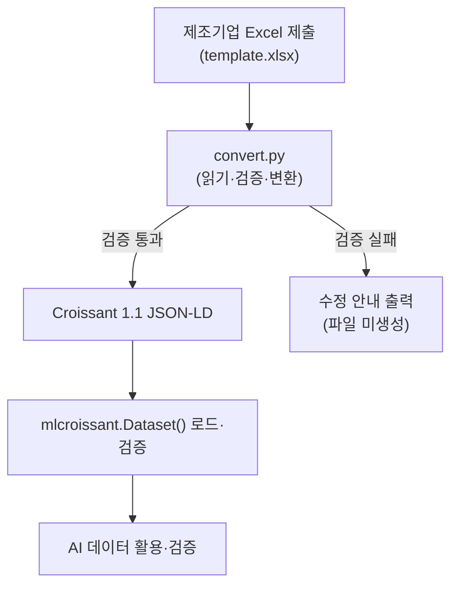

# Metadata Convertor

제조기업이 작성한 Excel 데이터 제출 양식을 MLCommons Croissant 1.1 표준(JSON-LD)으로 변환하는 Python 도구입니다.

## 개요

Excel에 입력된 데이터셋 기본 정보, 데이터 경로, 라벨 정보, 데이터 분할(split) 정보를 읽어 Croissant 메타데이터를 생성합니다.

기업마다 제각각인 방식으로 관리되던 제조 AI 데이터를 Croissant 표준으로 통일해, 이후 검색·공유·학습·검증에 일관되게 활용하는 것이 목적입니다.

변환 전에 필수값·형식·데이터 경로를 검사하며, 문제가 있으면 파일을 만들지 않고 무엇을 어떻게 고쳐야 하는지 안내합니다(아래 [검증](#검증) 참고).

## 동작 흐름



## 설치

Python 3.10 이상을 권장합니다.

```bash
pip install openpyxl mlcroissant
```

`requirements.txt`가 있다면:

```bash
pip install -r requirements.txt
```

> 변환 자체에는 `openpyxl`만 필요합니다. `mlcroissant`는 생성된 결과를 로드·검증하는 단계에서만 사용됩니다.

## 사용법

기본값으로 실행하면 현재 폴더의 `template.xlsx`를 읽어 `metadata.jsonld`를 생성합니다.

```bash
python convert.py
```

입력·출력을 직접 지정하려면:

```bash
python convert.py -i template.xlsx -o MAX_TR_DS01.jsonld
```

데이터 파일이 실제로 존재하는지까지 검사하려면 데이터 루트 폴더를 함께 지정합니다.

```bash
python convert.py -i template.xlsx -o MAX_TR_DS01.jsonld -d ./MAX_TR_DS01_root
```

| 인자 | 설명 | 기본값 |
|------|------|--------|
| `-i`, `--input` | 변환할 Excel 제출 양식 | `template.xlsx` |
| `-o`, `--output` | 출력 JSON-LD 파일 경로 | `metadata.jsonld` |
| `-d`, `--data-dir` | 데이터 실제 루트 폴더. 지정 시 FileSet 경로에 파일이 실제로 있는지 검사 | 없음(경로 검사 생략) |

## 검증

변환 직전에 다음을 검사합니다. **ERROR가 하나라도 있으면 출력 파일을 만들지 않고** 무엇을 고쳐야 하는지 항목별로 안내한 뒤 종료 코드 `1`을 반환합니다. WARNING만 있으면 파일은 생성하되 주의사항을 함께 출력합니다.

ERROR (파일 미생성):

- Excel의 `필수 여부`가 `Y`인 항목의 `입력`이 비어 있는 경우
- 데이터셋 ID에 공백·특수문자가 있거나 255자를 초과하는 경우 (허용: 영문/숫자/`-`/`_`/`.`)
- 파일 패턴이 `*.확장자` 형식이 아닌 경우
- 스플릿 비율이 숫자가 아니거나 0~1 범위를 벗어난 경우
- `-d`로 지정한 폴더가 없거나, FileSet 경로 패턴에 해당하는 파일이 하나도 없는 경우

WARNING (파일은 생성):

- 파일 확장자를 인식하지 못하는 경우
- 스플릿 비율의 합이 1이 아닌 경우
- 생성일이 `YYYY-MM-DD` 형식이 아닌 경우
- `클래스 수`와 실제 클래스 분류 개수가 다른 경우
- `-d`를 지정하지 않아 데이터 경로 존재 여부를 검사하지 못한 경우

종료 코드: `0` 성공 · `1` 검증 실패로 미생성 · `2` 입력 파일 없음. CI·파이프라인에서 그대로 활용할 수 있습니다.

출력 예시:

```
❌ 다음 문제 때문에 metadata.jsonld 를 생성하지 않았습니다. 수정 후 다시 실행해 주세요:

   - [기본정보] '설명' 은(는) 필수 항목입니다. → '입력' 열에 값을 채워주세요.
   - [03_데이터 스플릿 정보] train 비율 'abc' 이(가) 숫자가 아닙니다. → 0~1 사이 숫자로 입력하세요 (예: 0.83).

총 2개 항목을 수정해야 합니다.
```

## 변환 범위

| Excel 시트 | Croissant 매핑 |
|------------|----------------|
| 기본정보 | `name`, `alternateName`, `description`, `version`, `datePublished`, `keywords`, `creator`, `license`, `url`, `citeAs` |
| 01_데이터 정보 · 02_라벨 정보 | `distribution` — 스플릿별 이미지/라벨 FileSet |
| 02_라벨 정보(클래스 분류) | `recordSet` — 클래스 enumeration |
| 03_데이터 스플릿 정보 | `recordSet` — split enumeration + 스플릿별 경로 |
| 04_AI 모델 정보 | 제외 (Croissant는 데이터셋을 기술하는 포맷이라 모델 정보는 대상이 아님) |

참고 사항:

- `license`와 `url`은 코드 상단 상수(`LICENSE_URL`, `URL_TEMPLATE`)로 지정되며, 필요 시 그 값만 바꾸면 됩니다.
- `citeAs`(인용정보)는 Excel에 없으므로 제출기업·데이터셋 명·버전·ID·생성연도로 BibTeX 형태를 자동 생성합니다.
- 데이터는 오프라인 파일시스템에 loose 파일로 두어도 됩니다. FileSet은 별도 압축(zip) 없이 로컬 경로를 직접 참조하며 해시가 필요 없습니다.
- 검증 데이터(validation)는 선택 항목이라, 03 시트에 값이 없으면 해당 스플릿은 생성하지 않고 train/test만 만듭니다.

## 출력 확인

생성된 파일은 `mlcroissant`로 바로 로드·검증할 수 있습니다.

```python
import mlcroissant as mlc

dataset = mlc.Dataset("metadata.jsonld")
print(dataset.metadata.to_json())
```

레코드 단위로 데이터를 읽으려면 `dataset.records(record_set=...)`를 순회하면 되고, 이를 `tf.data.Dataset.from_generator(...)`나 PyTorch `IterableDataset`로 감싸 학습에 사용할 수 있습니다.

## 라이선스

모든 데이터셋의 라이선스는 아래 주소로 동일하게 적용됩니다.

https://maxalliance.kr/license/license.html

## 문의

M.AX 얼라이언스 추진단 — max@keit.or.kr

---

## 별첨. Croissant 포맷

### 무엇인가

Croissant는 머신러닝 데이터셋을 기술하기 위한 메타데이터 포맷입니다. 이미지, CSV, 텍스트 등 데이터 자체의 형식은 그대로 두고, 데이터셋의 구조와 의미를 설명하는 메타데이터 계층을 위에 얹는 방식으로 동작합니다. 웹 구조화 데이터 표준인 schema.org를 확장했으며, JSON-LD로 표현됩니다.

### 누가 만들었나

MLCommons 커뮤니티 워킹 그룹이 개발해 2024년 3월에 1.0을 공개했습니다. 초기 개발은 Google의 Dataset Search, Kaggle, TensorFlow Datasets 팀이 주도했고, 이후 Hugging Face, Meta, NASA, Harvard, Bayer, TU Eindhoven, Open Data Institute 등 산업계·학계가 함께 참여했습니다.

### 왜 쓰는가

기존 데이터셋을 재사용할 때 실무자는 데이터가 어떻게 구성돼 있는지 파악하고 어떤 부분을 학습에 쓸지 판단하는 데 상당한 시간을 씁니다. 데이터셋마다 구조와 문서화 방식이 다르기 때문입니다. Croissant는 이 표현 방식을 하나로 통일해 데이터를 찾고 이해하고 로드하는 비용을 줄입니다.

주요 이점은 다음과 같습니다.

- **발견 가능성** — schema.org 기반이라 Google Dataset Search 등에서 검색·색인이 쉽습니다.
- **이식성** — 데이터를 재포맷하지 않고 여러 플랫폼으로 옮길 수 있습니다.
- **상호운용성** — TensorFlow, PyTorch, JAX 등 주요 프레임워크에서 동일하게 로드됩니다.
- **문서화 표준화** — 데이터셋의 내용, 출처, 사용 제한을 일관된 방식으로 기술합니다.
- **책임 있는 AI** — 투명성·감사에 필요한 정보를 표준적으로 담아 AI 규제 대응에 유리합니다.

Hugging Face, Kaggle, OpenML, Google Dataset Search 등 주요 저장소가 지원하며, NeurIPS Datasets and Benchmarks Track에서 권장 데이터 아티팩트로 채택되었습니다.

### 참고

- MLCommons Croissant: https://mlcommons.org/working-groups/data/croissant/
- GitHub: https://github.com/mlcommons/croissant
- 명세(1.1): https://mlcommons.org/croissant/1.1
