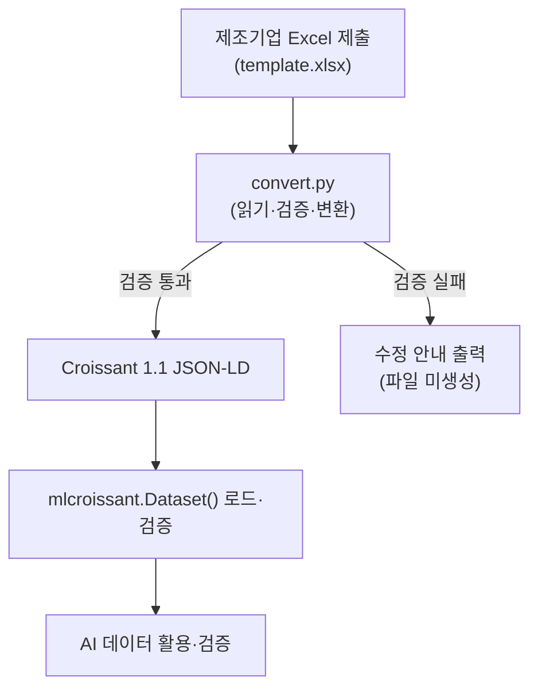

# Metadata Convertor

제조기업이 작성한 Excel 데이터 제출 양식을 MLCommons Croissant 1.1 표준(JSON-LD)으로 변환하는 Python 도구입니다.

## 개요

Excel에 입력된 데이터셋 기본 정보, 데이터 경로, 라벨 정보, 데이터 분할(split) 정보를 읽어 Croissant 메타데이터를 생성합니다.

이미지처럼 라벨이 별도 파일로 있는 데이터와 CSV처럼 라벨이 컬럼으로 들어 있는 데이터를 모두 지원하며, 라벨과 데이터를 잇는 방식(`데이터-라벨 매핑 기준`)에 따라 구조를 다르게 생성합니다(아래 [데이터–라벨 매핑](#데이터라벨-매핑) 참고). 한 폴더에 여러 형식(예: `*.jpg, *.png`)이 섞여 있어도 함께 처리합니다.

기업마다 제각각인 방식으로 관리되던 제조 AI 데이터를 Croissant 표준으로 통일해, 이후 검색·공유·학습·검증에 일관되게 활용하는 것이 목적입니다.

변환 전에 필수값·형식·데이터 경로를 검사하며, 문제가 있으면 파일을 만들지 않고 무엇을 어떻게 고쳐야 하는지 안내합니다(아래 [검증](#검증) 참고).

## 동작 흐름



## 설치

Python 3.10 이상을 권장합니다.

```bash
pip install openpyxl mlcroissant
```

`requirements.txt`가 있다면:

```bash
pip install -r requirements.txt
```

> 변환 자체에는 `openpyxl`만 필요합니다. `mlcroissant`는 생성된 결과를 로드·검증하는 단계에서만 사용됩니다.

## 사용법

기본값으로 실행하면 현재 폴더의 `template.xlsx`를 읽어, 데이터셋 ID를 파일명으로 한 JSON-LD(예: `MAX_TR_DS01.jsonld`)를 생성합니다. `-o`로 경로를 직접 지정할 수도 있습니다.

```bash
python convert.py
```

입력·출력을 직접 지정하려면:

```bash
python convert.py -i template.xlsx -o MAX_TR_DS01.jsonld
```

데이터 파일 존재 여부는 **엑셀 정보로 자동 검사**합니다. `01_데이터 정보`·`02_라벨 정보`의 데이터 경로와 `03_데이터 스플릿 정보`의 스플릿을 합쳐 실제 경로(예: `./MAX_SECOM_DS01/data/train/`)를 만들고, 그 위치에 파일이 있는지 확인합니다. 기준 폴더는 **현재 작업 폴더 또는 엑셀 파일이 있는 폴더**에서 자동으로 찾으므로, 보통은 데이터 폴더가 있는 곳에서 그냥 실행하면 됩니다.

```bash
# 데이터 폴더(예: ./MAX_SECOM_DS01/...)가 있는 위치에서 실행 → 자동 검증
python convert.py -i MAX_SECOM_DS01.xlsx
```

데이터가 다른 곳에 있으면 상위 폴더만 `-d`로 지정하고(선택), 데이터 없이 메타데이터만 만들려면 `--no-verify`를 씁니다.

```bash
python convert.py -i MAX_SECOM_DS01.xlsx -d /data/root   # 데이터 상위 폴더 지정(선택)
python convert.py -i MAX_SECOM_DS01.xlsx --no-verify     # 파일 검사 건너뛰기
```

| 인자 | 설명 | 기본값 |
|------|------|--------|
| `-i`, `--input` | 변환할 Excel 제출 양식 | `template.xlsx` |
| `-o`, `--output` | 출력 JSON-LD 파일 경로 | 데이터셋 ID (예: `MAX_TR_DS01.jsonld`) |
| `-d`, `--base-dir` | 데이터가 들어 있는 **상위 폴더**(선택). 미지정 시 현재 폴더 또는 엑셀 파일 폴더에서 자동 탐색 | 자동 탐색 |
| `--no-verify` | 실제 파일 존재 여부 검사를 건너뜀(메타데이터만 생성) | 꺼짐(검사 수행) |

## 검증

변환 직전에 다음을 검사합니다. **ERROR가 하나라도 있으면 출력 파일을 만들지 않고** 무엇을 고쳐야 하는지 항목별로 안내한 뒤 종료 코드 `1`을 반환합니다. WARNING만 있으면 파일은 생성하되 주의사항을 함께 출력합니다.

ERROR (파일 미생성):

- Excel의 `필수 여부`가 `Y`인 항목의 `입력`이 비어 있는 경우
- 데이터셋 ID에 공백·특수문자가 있거나 255자를 초과하는 경우 (허용: 영문/숫자/`-`/`_`/`.`)
- 파일 패턴이 `*.확장자` 형식이 아닌 경우 (여러 형식은 콤마로 구분, 예: `*.jpg, *.png`)
- `데이터-라벨 매핑 기준`이 `column`·`filename`·`id/key`·`index` 외의 값인 경우
- 매핑 기준이 `column` 또는 `id/key`인데 `라벨 컬럼`이 비어 있는 경우
- 스플릿 비율이 숫자가 아니거나 0~1 범위를 벗어난 경우
- 엑셀의 데이터 경로 폴더를 (현재 폴더·엑셀 폴더·`-d` 어디에서도) 찾지 못한 경우
- `데이터 경로 + 스플릿`으로 만든 경로에 패턴에 해당하는 파일/폴더가 하나도 없는 경우 (`--no-verify` 시 제외)

WARNING (파일은 생성):

- 파일 확장자를 인식하지 못하는 경우
- `데이터-라벨 매핑 기준`이 비어 있어 파일명(`filename`) 기반으로 간주한 경우
- 매핑 기준이 `filename`·`index`인데 `라벨 컬럼`이 채워져 있는 경우
- 매핑 기준이 `index`(저장 순서 기반)라 재정렬 시 매핑이 깨질 수 있는 경우
- 매핑 기준이 `column`인데 데이터 파일 패턴이 표(csv/tsv/parquet) 형식이 아닌 경우
- `column`/`id/key` 매핑에서 한 스플릿 폴더에 표 파일이 여러 개 있어 첫 파일만 사용한 경우
- 표 파일을 찾지 못해 경로를 패턴 그대로 넣은 경우(실제 파일명으로 대체 필요)
- 스플릿 비율의 합이 1이 아닌 경우
- 생성일이 `YYYY-MM-DD` 형식이 아닌 경우
- `클래스 수`와 실제 클래스 분류 개수가 다른 경우
- `--no-verify`로 파일 존재 여부 검사를 건너뛴 경우

종료 코드: `0` 성공 · `1` 검증 실패로 미생성 · `2` 입력 파일 없음. CI·파이프라인에서 그대로 활용할 수 있습니다.

출력 예시:

```
❌ 다음 문제 때문에 metadata.jsonld 를 생성하지 않았습니다. 수정 후 다시 실행해 주세요:

   - [기본정보] '설명' 은(는) 필수 항목입니다. → '입력' 열에 값을 채워주세요.
   - [03_데이터 스플릿 정보] train 비율 'abc' 이(가) 숫자가 아닙니다. → 0~1 사이 숫자로 입력하세요 (예: 0.83).

총 2개 항목을 수정해야 합니다.
```

## 데이터–라벨 매핑

라벨이 데이터와 **어떻게 짝지어지는지**(`02_라벨 정보` 시트의 `데이터-라벨 매핑 기준`)에 따라 생성되는 Croissant 구조가 달라집니다. 네 가지를 지원합니다.

| 매핑 기준 | 의미 | 생성 구조 | 예시 |
|-----------|------|-----------|------|
| `column` | 라벨이 데이터와 같은 행(레코드) 안 컬럼에 있음(조인 불필요) | 스플릿별 표 파일(FileObject)에서 `라벨 컬럼`을 추출하는 필드 | SECOM CSV의 `Pass/Fail` 컬럼 |
| `filename` | 데이터 파일명으로 라벨 파일을 찾음 | 데이터·라벨을 각각 FileSet으로 만들고 파일명으로 매핑 | 이미지 `a.jpg` ↔ 라벨 `a.txt` |
| `id/key` | 명시적 식별자 컬럼으로 두 테이블을 조인 | `column`과 동일하게 라벨 컬럼을 추출(조인 키는 학습 코드에서 지정) | ID로 연결된 별도 라벨 테이블 |
| `index` | 저장 순서(i번째↔i번째)로 매칭 | `filename`과 동일한 파일 기반 구조 | 순서만 맞춘 데이터/라벨 |

- `라벨 컬럼`은 `column`·`id/key`일 때 **필수**이고, `filename`·`index`일 때는 공란입니다.
- 클래스 인덱스는 음수(예: `-1: Pass`)도 지원합니다. 클래스 ID가 모두 정수면 정수형, 아니면 문자열형으로 기술합니다.
- `index`는 데이터나 라벨을 재정렬하면 매핑이 깨지므로, 재현성을 위해 로더의 정렬 기준을 고정해야 합니다.
- `id/key`는 현재 템플릿에 조인 키 컬럼 칸이 없어 라벨 컬럼만 추출하고, 조인 키는 학습 코드에서 지정하도록 안내(WARNING)합니다.

## 변환 범위

| Excel 시트 | Croissant 매핑 |
|------------|----------------|
| 기본정보 | `name`, `alternateName`, `description`, `version`, `datePublished`, `keywords`, `creator`, `license`, `url`, `citeAs` |
| 01_데이터 정보 · 02_라벨 정보 | `distribution` — 매핑 기준에 따라 스플릿별 데이터/라벨 FileSet(`filename`·`index`) 또는 스플릿별 데이터 FileObject(`column`·`id/key`) |
| 02_라벨 정보(클래스 분류) | `recordSet` — 클래스 enumeration |
| 03_데이터 스플릿 정보 | `recordSet` — split enumeration + 스플릿별 경로 |
| 04_AI 모델 정보 | 제외 (Croissant는 데이터셋을 기술하는 포맷이라 모델 정보는 대상이 아님) |

참고 사항:

- `license`와 `url`은 코드 상단 상수(`LICENSE_URL`, `URL_TEMPLATE`)로 지정되며, 필요 시 그 값만 바꾸면 됩니다.
- `citeAs`(인용정보)는 Excel에 없으므로 제출기업·데이터셋 명·버전·ID·생성연도로 BibTeX 형태를 자동 생성합니다.
- `파일 패턴`에 여러 형식을 함께 적으면(예: `*.jpg, *.png`) 하나의 FileSet이 그 형식들을 모두 포함합니다.
- 데이터는 오프라인 파일시스템에 loose 파일로 두어도 됩니다. 각 스플릿 폴더를 디렉토리 FileObject로 참조하고 그 안에서 패턴으로 파일을 모으며, 별도 압축(zip)이나 해시 없이 동작합니다(메타데이터에 `isLiveDataset: true`를 넣어 해시 없는 로컬 파일도 검증을 통과함).
- 실제 파일 경로는 `데이터 경로 + 스플릿 하위폴더`(예: `MAX_SECOM_DS01/data/train/`)로 만들어 검사합니다. 별도 플래그 없이도 현재 폴더나 엑셀 파일 폴더를 기준으로 자동 탐색합니다.
- `column`/`id/key` 매핑에서 스플릿이 여러 개면 스플릿별 표 파일을 각각 FileObject로 만들고 스플릿별 레코드셋에서 라벨 컬럼을 추출합니다. `-d`(또는 자동 탐색)로 데이터를 찾으면 실제 파일명까지 채워 넣습니다.
- 검증 데이터(validation)는 선택 항목이라, 03 시트에 값이 없으면 해당 스플릿은 생성하지 않고 train/test만 만듭니다.

## 출력 확인

생성된 파일은 `mlcroissant`로 바로 로드·검증할 수 있습니다.

```python
import mlcroissant as mlc

dataset = mlc.Dataset("metadata.jsonld")
print(dataset.metadata.to_json())
```

레코드 단위로 데이터를 읽으려면 `dataset.records(record_set=...)`를 순회하면 되고, 이를 `tf.data.Dataset.from_generator(...)`나 PyTorch `IterableDataset`로 감싸 학습에 사용할 수 있습니다. 여러 record set을 잇달아 읽을 때는, `mlcroissant`가 내부 연산 그래프를 재사용하며 오류가 나는 경우가 있어 record set마다 `Dataset` 객체를 새로 만드는 것이 안전합니다.

## 라이선스

모든 데이터셋의 라이선스는 아래 주소로 동일하게 적용됩니다.

https://maxalliance.kr/license/license.html

## 문의

M.AX 얼라이언스 추진단 — max@keit.or.kr

---

## 별첨. Croissant 포맷

### 무엇인가

Croissant는 머신러닝 데이터셋을 기술하기 위한 메타데이터 포맷입니다. 이미지, CSV, 텍스트 등 데이터 자체의 형식은 그대로 두고, 데이터셋의 구조와 의미를 설명하는 메타데이터 계층을 위에 얹는 방식으로 동작합니다. 웹 구조화 데이터 표준인 schema.org를 확장했으며, JSON-LD로 표현됩니다.

### 누가 만들었나

MLCommons 커뮤니티 워킹 그룹이 개발해 2024년 3월에 1.0을 공개했습니다. 초기 개발은 Google의 Dataset Search, Kaggle, TensorFlow Datasets 팀이 주도했고, 이후 Hugging Face, Meta, NASA, Harvard, Bayer, TU Eindhoven, Open Data Institute 등 산업계·학계가 함께 참여했습니다.

### 왜 쓰는가

기존 데이터셋을 재사용할 때 실무자는 데이터가 어떻게 구성돼 있는지 파악하고 어떤 부분을 학습에 쓸지 판단하는 데 상당한 시간을 씁니다. 데이터셋마다 구조와 문서화 방식이 다르기 때문입니다. Croissant는 이 표현 방식을 하나로 통일해 데이터를 찾고 이해하고 로드하는 비용을 줄입니다.

주요 이점은 다음과 같습니다.

- **발견 가능성** — schema.org 기반이라 Google Dataset Search 등에서 검색·색인이 쉽습니다.
- **이식성** — 데이터를 재포맷하지 않고 여러 플랫폼으로 옮길 수 있습니다.
- **상호운용성** — TensorFlow, PyTorch, JAX 등 주요 프레임워크에서 동일하게 로드됩니다.
- **문서화 표준화** — 데이터셋의 내용, 출처, 사용 제한을 일관된 방식으로 기술합니다.
- **책임 있는 AI** — 투명성·감사에 필요한 정보를 표준적으로 담아 AI 규제 대응에 유리합니다.

Hugging Face, Kaggle, OpenML, Google Dataset Search 등 주요 저장소가 지원하며, NeurIPS Datasets and Benchmarks Track에서 권장 데이터 아티팩트로 채택되었습니다.

### 참고

- MLCommons Croissant: https://mlcommons.org/working-groups/data/croissant/
- GitHub: https://github.com/mlcommons/croissant
- 명세(1.1): https://mlcommons.org/croissant/1.1
