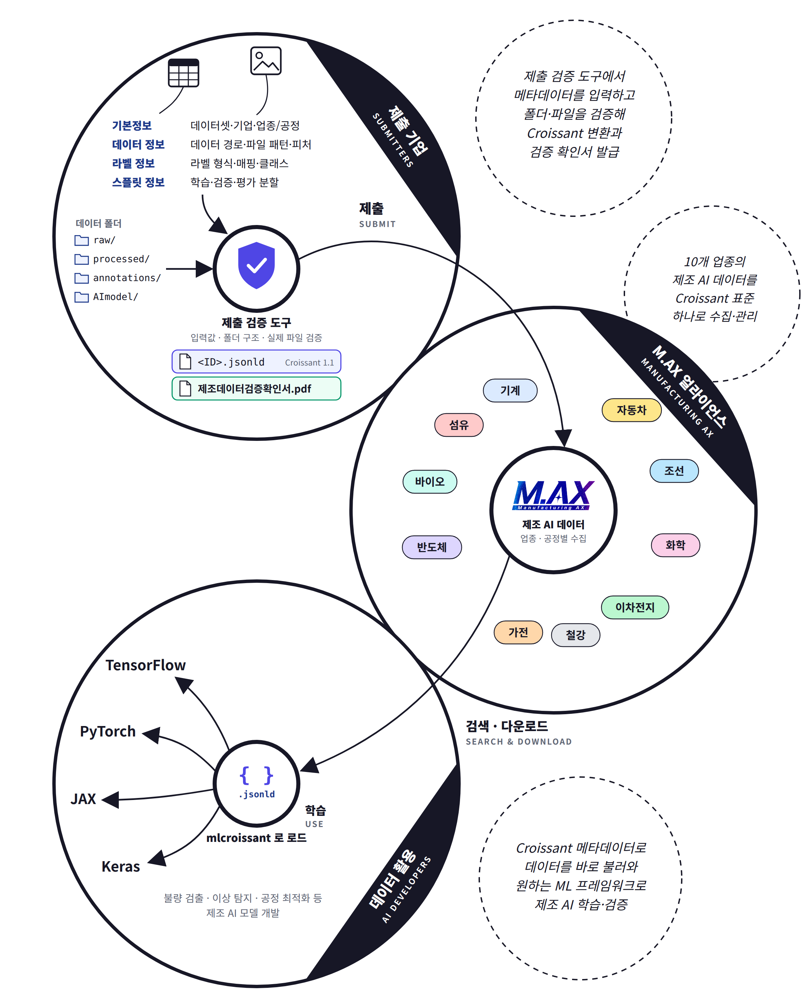
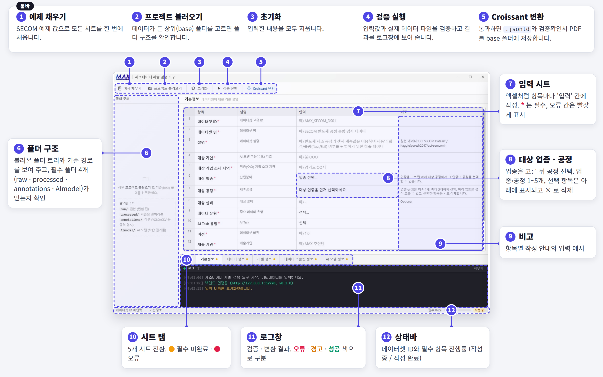

# 제조데이터 제출 검증 도구

M.AX 얼라이언스에 제출할 **제조 데이터의 형식을 검사하고, 제출 파일을 생성해 주는** Windows 프로그램입니다.

제출 데이터 폴더를 선택하고 화면에 데이터 정보를 입력하면, 빠진 항목이나 잘못된 파일이 없는지 검사합니다. 검사를 통과하면 제출에 필요한 두 개 파일(metadata, 확인서)이 자동으로 생성됩니다.

- **`<데이터셋 ID>.jsonld`** — 메타데이터. 국제 표준 형식([Croissant](https://mlcommons.org/croissant/1.1))으로 저장됩니다.
- **`제조데이터검증확인서.pdf`** — 검사를 통과했다는 확인서

## 다운로드

[](https://github.com/max-alliance/max-data/releases/latest)

**[⬇ 최신 버전 설치 파일 받기](https://github.com/max-alliance/max-data/releases/latest)** — 페이지 아래 *Assets*에서 `metadata_validator-Setup-<버전>.exe`를 내려받으세요.

- 이전 버전과 버전별 변경 내용: [전체 릴리스 목록](https://github.com/max-alliance/max-data/releases)
- Windows 10/11용입니다.

## 제조 데이터 제출 개요



## 사용 방법

1. **설치** — [다운로드](#다운로드)에서 받은 `metadata_validator-Setup-<버전>.exe`를 실행합니다.
2. **데이터 폴더 준비** — 아래 [데이터 폴더 준비](#데이터-폴더-준비)대로 폴더를 정리합니다.
3. **프로젝트 불러오기** — 데이터가 들어 있는 폴더를 선택합니다.
4. **내용 입력** — 아래쪽 탭 5개(기본정보 · 데이터 정보 · 라벨 정보 · 데이터 스플릿 정보 · AI 모델 정보)를 차례로 작성합니다.
5. **검증 실행** — 로그창에 오류(빨간색 표시)가 없어질 때까지 수정합니다.
6. **Croissant 변환** — 검증을 완료한 후 메타데이터 변환을 실행하면 제출 파일 두 개가 데이터 폴더에 저장됩니다.

## 화면 구성



## 데이터 폴더 준비

제출할 제조 데이터 폴더 안에 아래 **4개 폴더가 모두** 있어야 합니다.

```
내 데이터 폴더/
├── raw/            원본 데이터
├── processed/      학습용으로 정리한 데이터
│   ├── train/      학습용 (필수)
│   ├── validation/ 검증용 (선택)
│   └── test/       평가용 (필수)
├── annotations/    라벨 파일
└── AImodel/        학습한 AI 모델
```

- 입력 화면의 '데이터 경로'에는 이 폴더 기준으로 `./processed`, `./annotations`을 작성합니다.
- (중요) CSV, Excel 같은 Tabular 데이터를 제출하는 경우, 파일내 **첫 행(Row)은 열(Column) 이름**이어야 합니다.

## 데이터 입력 참고사항

- **`*` 표시**가 있는 항목은 꼭 채워야 합니다. 각 항목의 **비고** 칸에 작성 예시가 있습니다.
- **데이터셋 ID**는 영문·숫자·`-`·`_`·`.`만 쓸 수 있습니다. (예: `MAX_SECOM_DS01`)
- **대상 업종·공정**은 업종을 먼저 고른 뒤 공정을 고릅니다. 1~5개까지 고를 수 있습니다.
- **데이터 유형**은 현재 Image, Tabular(표) 두 가지를 지원합니다. (그 외의 데이터 유형의 경우, 현 체계에 준하도록 제출)
- **Tabular 데이터**는 '입력(Feature) 컬럼'에 학습에 쓸 컬럼을 셀 주소로 적습니다. (예: `B1:VS1`)
- **스플릿 비율**은 0~1 사이 숫자로, 합이 1이 되게 적습니다. (예: 학습 0.8, 테스트 0.2)
- **데이터-라벨 매핑 기준**은 입력 데이터의 라벨을 참조 하는 방법에 따라 고릅니다.

  | 선택 | 이럴 때 | 예시 |
  |------|---------|------|
  | `column` | 라벨이 데이터 표 안의 한 컬럼일 때 | CSV의 `Pass/Fail` 컬럼 |
  | `filename` | 데이터 파일과 라벨 파일의 이름이 같을 때 | `a.jpg` ↔ `a.txt` |
  | `id/key` | 데이터 표와 라벨 표가 따로 있고, 같은 ID 컬럼으로 연결될 때 | 두 표 모두 `id` 컬럼 |
  | `index` | 순서로만 짝이 맞을 때 (1번째 ↔ 1번째) | 순서대로 저장된 데이터·라벨 |

  `column`이나 `id/key`를 고르면 '라벨 컬럼'에 실제 컬럼 이름을 정확히 적어야 합니다.

## 검증 결과 확인

**검증 실행**을 누르면 결과가 아래쪽 로그창에 나옵니다.

- **빨간 글씨(오류)**: 고쳐야 제출 파일이 만들어집니다. 문제가 있는 칸도 빨갛게 표시됩니다.
- **노란 글씨(경고)**: 제출 파일은 만들어지지만, 한 번 확인해 보세요.

자주 나오는 오류:

| 오류 | 고치는 방법 |
|------|------------|
| 필수 폴더 누락 | 데이터 폴더에 `raw`, `processed`, `annotations`, `AImodel` 폴더를 만듭니다. |
| 파일이 없습니다 | 데이터 경로와 스플릿 폴더(`train`, `test`)에 파일이 있는지, 파일 패턴(`*.csv` 등)이 맞는지 확인합니다. |
| 필수 항목입니다 | `*` 표시 항목을 채웁니다. 아래 탭의 노란 점이 미완료 시트입니다. |
| 라벨 컬럼이 헤더에 없습니다 | '라벨 컬럼'을 CSV 첫 줄의 컬럼 이름과 똑같이 적습니다. |
| 라벨 값이 선언한 클래스와 다릅니다 | '클래스 분류'에 실제 데이터의 라벨 값을 모두 적습니다. (예: `-1 : Pass`, `1 : Fail`) |
| 비율이 숫자가 아닙니다 | 스플릿 비율을 `0.8`처럼 숫자로 적습니다. |

## 제출 파일

**Croissant 변환**을 누르면 선택한 데이터 폴더에 두 파일이 저장됩니다. 다시 변환하면 새 파일로 바뀝니다.

| 파일 | 내용 |
|------|------|
| `<데이터셋 ID>.jsonld` | 데이터 설명서 (예: `MAX_SECOM_DS01.jsonld`) |
| `제조데이터검증확인서.pdf` | 입력 정보, 폴더별 파일 수·용량, 검사 결과를 담은 A4 한 장짜리 확인서 |

- 확인서 번호와 직인 칸은 비워서 발급됩니다.
- 확인서 PDF를 열어 둔 채로 변환하면 저장되지 않습니다. PDF를 닫고 다시 누르세요.

---

## 문의

M.AX 얼라이언스 추진단 — max@keit.or.kr

데이터 라이선스: https://maxalliance.kr/license/license.html
